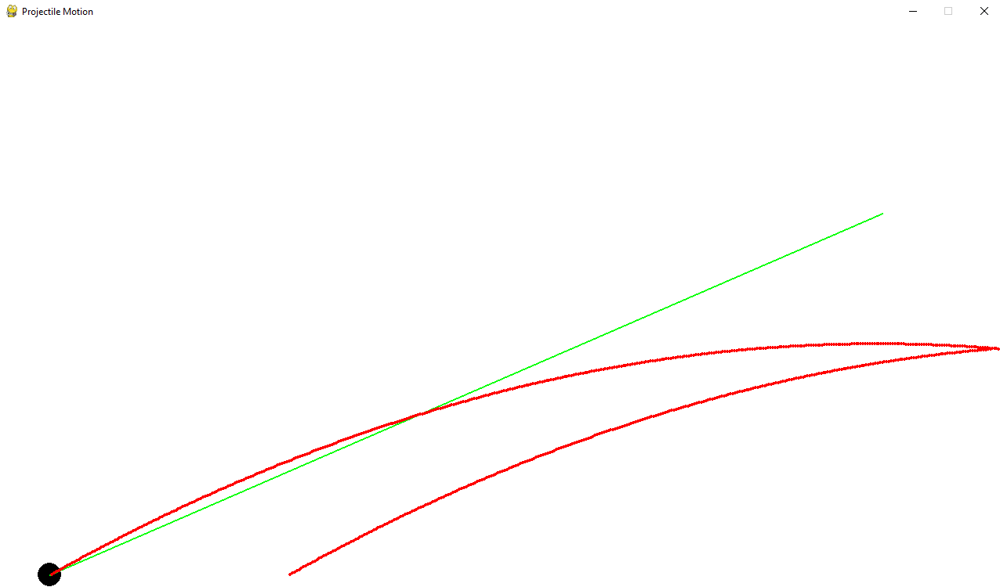

# Projectile_Motion

Trying to create a projectile motion game from scratch with pygame.

If you manage to throw the ball out of the screen , it will be automatically brought back to the inital point. 
Furthermore, you can press the 'R' key in order to reset any ball, regardless of its position.
 

I intended to create a endless rebound ball, but It does not seem to work.
It sometimes rebounds twice, or even just once.
Feel free to try it out and make all changes you want.